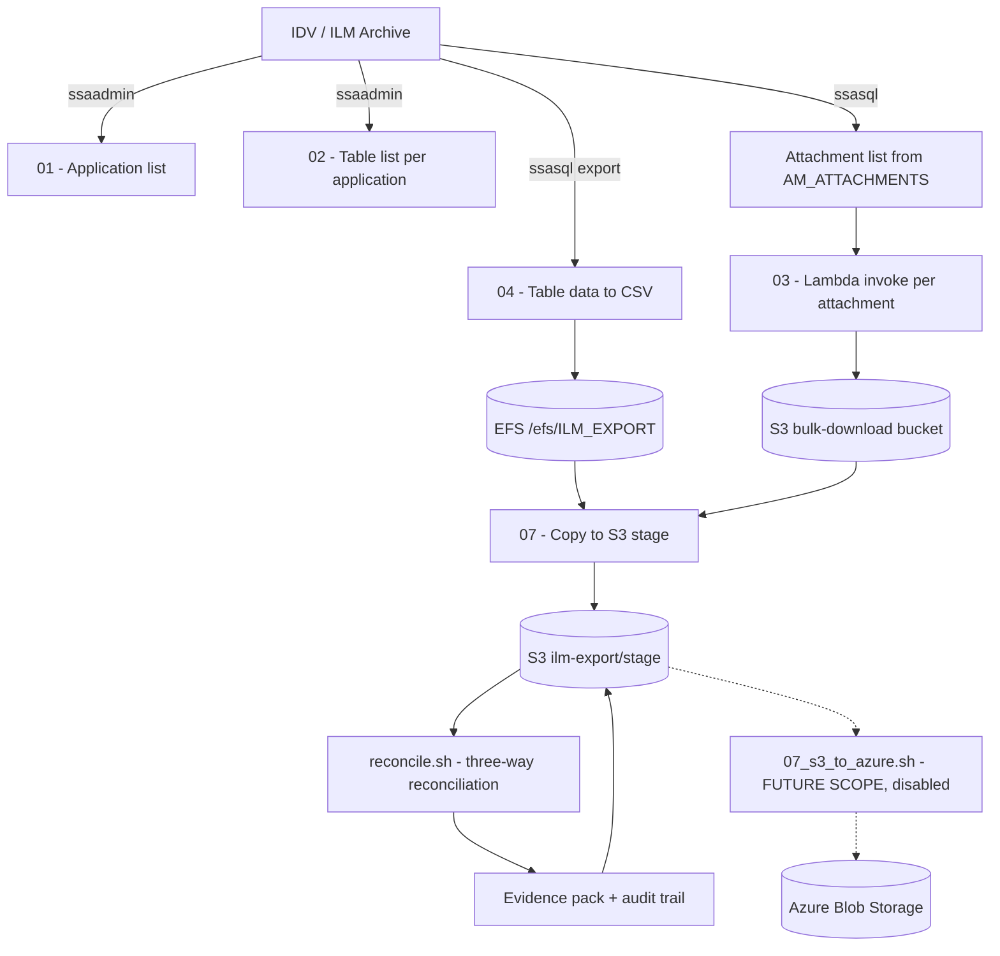

# ILM Extraction Pipeline

Automated extraction, transfer and GxP-compliant validation of archived application data from **Informatica Data Vault (IDV / ILM)** to **AWS S3**.

The pipeline extracts database tables and document attachments for every archived application, reconciles what was extracted against source and target, and produces a sealed evidence package suitable for regulated (GxP / 21 CFR Part 11) review.

> **Scope note:** onward movement from S3 to **Azure Blob Storage** is *future scope*. The
> implementation is included in the repository but is disabled and is **not** invoked by the
> pipeline. See [Future scope](#future-scope-s3-to-azure).

---

## Table of contents

- [Architecture](#architecture)
- [Repository structure](#repository-structure)
- [Prerequisites](#prerequisites)
- [Configuration](#configuration)
- [Quick start](#quick-start)
- [Script reference](#script-reference)
- [Pipeline stages](#pipeline-stages)
- [Traceability and audit trail](#traceability-and-audit-trail)
- [Restartability](#restartability)
- [Progress reporting](#progress-reporting)
- [Evidence and reconciliation](#evidence-and-reconciliation)
- [Future scope: S3 to Azure](#future-scope-s3-to-azure)
- [Logging framework](#logging-framework)
- [Output layout](#output-layout)
- [Security](#security)
- [Troubleshooting](#troubleshooting)
- [Exit codes](#exit-codes)

---

## Architecture



**Data flow summary**

| Stage | Source | Target |
|---|---|---|
| Table extraction | IDV database | `$EXPORT_PATH/{APP}/{TABLE}.csv` on EFS |
| Attachment extraction | IDV filesystem via Lambda | `s3://{ATT_S3_BUCKET}/{APP}/` |
| Consolidation | EFS + attachment bucket | `s3://{TARGET_S3_BUCKET}/stage/{APP}/` |
| Evidence | Local metadata | `s3://{TARGET_S3_BUCKET}/stage/_evidence/{RUN_ID}/` |
| Archive tier *(future)* | S3 stage | Azure Blob container |

---

## Repository structure

```
scripts/
├── .conf.ini                 # Live configuration (git-ignored, contains secrets)
├── .conf.ini.example         # Template - copy to .conf.ini and fill in
│
├── logger.sh                 # Universal logging framework
├── lib_trace.sh              # Run IDs, audit trail, evidence manifests, checksums
├── lib_checkpoint.sh         # Restartability / resume support
├── lib_progress.sh           # Progress bar and ETA
├── lib_s3.sh                 # Count-verified, audited S3 uploads
│
├── 00_aws_configure.sh       # Configure and verify AWS CLI access
├── 01_applications_list.sh   # Discover all archived applications
├── 02_app_table_list.sh      # Discover tables per application
├── 03_app_attachement_extraction.sh  # Extract attachments via Lambda
├── 04_app_table_extraction.sh        # Export tables to CSV with headers
├── 05_app_copy_to_s3.sh      # Standalone per-application copy to S3
├── 06_aws_invoke.sh          # Single-attachment Lambda smoke test
├── 07_s3_to_azure.sh         # FUTURE SCOPE - S3 to Azure, disabled
│
├── ilm_pipeline.sh           # Full orchestrated pipeline (steps 1-9)
├── reconcile.sh              # Reconciliation + GxP validation report
└── smoke_test.sh             # Non-destructive preflight validation
```

---

## Prerequisites

> **Line endings.** All files are stored with Unix (LF) endings and
> [.gitattributes](.gitattributes) enforces `eol=lf`, so a `git clone` on Linux needs no
> conversion and `dos2unix` is **not** required. If files are ever transferred by other
> means and arrive with CRLF, `smoke_test.sh` detects it and prints a `sed` based fix.

| Requirement | Notes |
|---|---|
| **bash 4.0+** | `logger.sh` uses `${var^^}` case conversion |
| **Informatica IDV** | `ssaadmin` and `ssasql` on `PATH` via `$IDV_HOME/ssaenv.sh` |
| **AWS CLI v2** | Configured credentials or an instance role |
| **sha256sum** or **shasum** | Required for GxP evidence checksums |
| **EFS mount** | Writable `/efs/ILM_EXPORT` (or your `EXPORT_PATH`) |
| ~~azcopy~~ | *Future scope only - not required today* |
| ~~az CLI~~ | *Future scope only - not required today* |

### Required AWS permissions

```
sts:GetCallerIdentity
s3:ListBucket, s3:GetObject          on the attachment bucket
s3:ListBucket, s3:GetObject, s3:PutObject, s3:DeleteObject  on the target bucket
lambda:InvokeFunction                on the extraction function
```

> `lambda:GetFunction` is **not** required. `00_aws_configure.sh` only warns if it is missing.

---

## Configuration

All configuration lives in a **single file**, `scripts/.conf.ini`.

```bash
cd scripts
cp .conf.ini.example .conf.ini
chmod 600 .conf.ini          # contains credentials
vi .conf.ini
```

### Configuration reference

| Variable | Purpose | Example |
|---|---|---|
| `IDV_HOME` | IDV installation root | `/opt/app/01/idv` |
| `ADMIN_USER` / `ADMIN_PASS` | `ssaadmin` credentials | |
| `DB_USER` / `DB_PASS` | `ssasql` credentials | |
| `EXPORT_PATH` | EFS root for extracted CSVs | `/efs/ILM_EXPORT` |
| `ILM_METADATA_PATH` | Metadata, audit, evidence, checkpoints | `/efs/ILM_EXPORT/ilm_metadata` |
| `LOG_PATH` | Log destination | `/efs/ILM_EXPORT/logs` |
| `APP_PAUSE_SECONDS` | Pause before each application so progress is readable. `0` for unattended runs | `3` |
| `AWS_REGION` | AWS region | `eu-central-1` |
| `AWS_PROFILE` | Optional named profile | |
| `ENV` | `qa` or `prod` - part of the run ID | `qa` |
| `LAMBDA_FUNC` | Attachment download function | `qa-informatica-bulk-app-file-download` |
| `ATT_S3_BUCKET` | Bucket the Lambda writes to | `s3://bulk-download.example.com` |
| `EXPORT_LOC` | Same bucket without `s3://` | derived automatically |
| `TARGET_S3_BUCKET` | Destination bucket | `s3://ilm-export` |
| `TARGET_S3_STAGE` | Stage prefix | `$TARGET_S3_BUCKET/stage` |

The `AZURE_*` block in `.conf.ini` is commented out because the Azure transfer is
future scope. See [Future scope](#future-scope-s3-to-azure).

> **Never** append `$APP_NAME` to `EXPORT_LOC` or `SOURCE_PATH`. The scripts append the
> application name themselves; doing it twice produces empty path segments.

---

## Quick start

```bash
cd scripts

# 1. Configure AWS access (interactive, credentials never logged)
bash 00_aws_configure.sh

# 2. Validate the environment - nothing is written or extracted
bash smoke_test.sh

# 3. Run the full pipeline
bash ilm_pipeline.sh

# 4. If it was interrupted, resume without repeating completed work
bash ilm_pipeline.sh --resume
```

Always run `smoke_test.sh` first on a new host. It validates syntax, configuration,
tooling, paths, permissions and AWS access before any data is touched.

---

## Script reference

| Script | Purpose | Arguments |
|---|---|---|
| `00_aws_configure.sh` | Configure and verify AWS CLI, S3 and Lambda access | none |
| `01_applications_list.sh` | Write `application_list.txt`, sorted alphabetically | none |
| `02_app_table_list.sh` | Write `{APP}/{APP}_table_list.csv` for every application | none |
| `03_app_attachement_extraction.sh` | Invoke Lambda per attachment | `<attachment_list.csv>` |
| `04_app_table_extraction.sh` | Export tables to CSV with headers | `<table_list.csv>` |
| `05_app_copy_to_s3.sh` | Copy one application's data, evidence and logs to S3 | `<APP_NAME>` |
| `06_aws_invoke.sh` | Invoke the Lambda once as a smoke test | `[APP] [DIR] [NAME]` |
| `07_s3_to_azure.sh` | *Future scope - disabled* | `[--prefix APP] [--dry-run]` |
| `ilm_pipeline.sh` | Full orchestration, steps 1-9 | `[--resume\|--fresh]` |
| `reconcile.sh` | Reconciliation and GxP validation report | `<APP_NAME> [RUN_ID]` |
| `smoke_test.sh` | Preflight validation | `[--no-aws]` |

---

## Pipeline stages

`ilm_pipeline.sh` executes nine stages. Steps 3-8 run once per application.

| Step | Action | Output |
|---|---|---|
| 1 | List ILM applications (sorted alphabetically) | `application_list.txt` |
| 2 | Generate table lists | `{APP}/{APP}_table_list.csv` |
| 3 | Query `AM_ATTACHMENTS` | `{APP}_attachment_list.csv` |
| 4 | Extract attachments via Lambda | `s3://{ATT_S3_BUCKET}/{APP}/` |
| 5 | Extract tables to CSV | `$EXPORT_PATH/{APP}/{TABLE}.csv` |
| 6 | Generate metadata report | `{APP}_metadata_{ts}.csv` |
| 7 | Copy data, metadata and logs to S3 | `{stage}/{APP}/` |
| 8 | Reconciliation and evidence | `reconciliation_{APP}.csv` |
| 9 | Transfer evidence, audit trail and logs to S3 | `{stage}/_evidence/`, `_audit/`, `logs/` |

**Error handling.** Failures in steps 1 and 2 are fatal. Per-application failures in
steps 3-8 are logged as warnings, recorded in the audit trail, and the pipeline
continues to the next application. The run exits non-zero if any application failed
or any reconciliation failed.

**Empty tables.** `ssasql` writes no file when a result set is empty. This is a valid
outcome, so `04_app_table_extraction.sh` creates a header-only CSV and counts the
table as extracted with 0 rows. A missing file *without* a `0 rows fetched` marker is
treated as a genuine failure and reported.

Both `03_app_attachement_extraction.sh` and `04_app_table_extraction.sh` print a
per-application summary (processed / exported / empty / failed) and exit non-zero if
any item failed, listing the failures.

---

## Traceability and audit trail

Every run is assigned a unique identifier:

```
RUN_ID = <env>_<utcTimestamp>_<host>_<pid>
example: qa_20260810T142233Z_ilmhost01_31245
```

Every operation appends a record to an **append-only** audit trail at
`$ILM_METADATA_PATH/audit/audit_trail_<RUN_ID>.csv`:

| Column | Description |
|---|---|
| `run_id` | Run identifier |
| `event_seq` | Monotonic sequence - gaps reveal missing records |
| `event_utc` | UTC timestamp, independent of local time zone |
| `actor` | `user@host` that performed the action |
| `host`, `script`, `step` | Where the action originated |
| `application`, `object_type`, `object_id` | What was acted on |
| `action`, `status` | What was done and the outcome |
| `record_count`, `size_bytes` | Volume moved |
| `message` | Free-text detail |

The trail is never rewritten or truncated. Resuming a run appends to the existing
trail and continues the sequence.

---

## Restartability

Each completed unit of work is checkpointed as `<APPLICATION>|<STEP>` in
`$ILM_METADATA_PATH/checkpoints/<RUN_ID>.ckpt`, flushed immediately so an abrupt
termination cannot lose it.

```bash
bash ilm_pipeline.sh            # new run
bash ilm_pipeline.sh --resume   # continue the last incomplete run
bash ilm_pipeline.sh --fresh    # ignore checkpoints, start over
```

`--resume` rejoins the **same** `RUN_ID`, so the audit trail and evidence package
remain a single coherent record rather than fragmenting across attempts. Completed
work is skipped and logged as `[RESUME] ... skipping`.

The resume pointer is cleared **only** when the entire run, including the evidence
transfer in step 9, completes cleanly.

---

## Progress reporting

Progress is rendered through the logger, so it appears on the console *and* in the
log file without ANSI escape codes:

```
[2026-08-10 14:22:31] [INFO ] [########............] 40% (2/5) elapsed 00:01:10 eta 00:01:45 - LIFEDOC_QA
```

---

## Evidence and reconciliation

### Reconciliation

`reconcile.sh` performs a three-way comparison per application:

| Dimension | Source | Extract | Target |
|---|---|---|---|
| Tables | expected table list | CSV row count | S3 object + byte size |
| Attachments | attachment list rows | - | S3 object count |
| Metadata | local file count | - | S3 object count |

Every object is recorded as `PASS` or `FAIL` with the discrepancy reason.

> Tables are verified by **byte size** rather than checksum, because an S3 ETag is not
> an MD5 for multipart uploads. The local SHA-256 is recorded in the manifest for
> independent verification.

### Evidence package

Written to `$ILM_METADATA_PATH/evidence/<RUN_ID>/` and mirrored to S3:

| Artifact | Contents |
|---|---|
| `manifest_{APP}.csv` | Every artifact with size, SHA-256, row count, S3 URI, timestamp, actor |
| `reconciliation_{APP}.csv` | Per-object PASS/FAIL detail |
| `validation_summary_{APP}.txt` | Human-readable summary with reviewer/approver sign-off block |
| `MANIFEST.sha256` | Checksums sealing every manifest and the audit trail |

After sealing, evidence files are set to mode `444` so they cannot be silently
altered, and the whole package is uploaded to
`s3://{TARGET_S3_BUCKET}/stage/_evidence/{RUN_ID}/`.

---

## Future scope: S3 to Azure

> **Not active.** The S3 to Azure movement is planned for a later phase. The
> implementation is committed so it is ready to enable, but it is **not** called by
> `ilm_pipeline.sh`, its configuration block in `.conf.ini` is commented out, and the
> script exits immediately unless `AZURE_TRANSFER_ENABLED="true"`.

`07_s3_to_azure.sh` copies the staged export (data, metadata, evidence, audit trail
and logs) from the S3 stage prefix into an Azure Blob container, then reconciles S3
object count against Azure blob count and records the transfer in the audit trail.

### Enabling it later

1. Uncomment the `AZURE_*` block in `.conf.ini` and fill in the values
2. Set `AZURE_TRANSFER_ENABLED="true"`
3. Install `azcopy` (and optionally the `az` CLI for independent verification)
4. Re-enable section 11 in `smoke_test.sh` (retained, commented out)

```bash
bash 07_s3_to_azure.sh --dry-run              # plan only
bash 07_s3_to_azure.sh                        # whole stage
bash 07_s3_to_azure.sh --prefix LIFEDOC_QA    # one application
```

### Transfer modes

| Mode | Behaviour | Use when |
|---|---|---|
| `direct` | azcopy streams S3 to Azure server-side | Static AWS access keys are available |
| `staged` | `aws s3 sync` to local temp, then azcopy upload | Using IAM roles, or egress is restricted |

### Authentication modes

| Mode | Credentials |
|---|---|
| `sas` | `$AZURE_SAS_TOKEN`, or a `chmod 600` file at `$AZURE_SAS_FILE` |
| `spn` | `$AZURE_TENANT_ID`, `$AZURE_CLIENT_ID`, `$AZURE_CLIENT_SECRET` |
| `msi` | Managed identity - no additional configuration |

SAS tokens and client secrets are **never** written to logs. All azcopy output passes
through a redaction filter that strips `sig=` and `sv=` query parameters.

---

## Logging framework

`logger.sh` is sourced by every script.

```bash
SCRIPT_DIR="$(cd "$(dirname "${BASH_SOURCE[0]}")" && pwd)"
. "$SCRIPT_DIR/logger.sh"

log_init "/path/to/file.log"   # optional - console only if omitted
log INFO "message"
log_warn "something odd"
error_exit "unrecoverable"     # logs FATAL and exits 1
```

| Function | Purpose |
|---|---|
| `log_init [file]` | Create the log directory and file, verify writability |
| `log LEVEL msg` | Core logging call |
| `log_debug/info/warn/error/step` | Convenience wrappers |
| `log_line`, `log_banner` | Separators and boxed headers |
| `step_banner`, `step_complete` | Step traceability with durations |
| `error_exit msg [code]` | Log FATAL and terminate |
| `warn msg` | Log WARN and continue |
| `log_trap_int [msg]` | Clean Ctrl+C handler |

| Variable | Default | Purpose |
|---|---|---|
| `LOG_FILE` | *(empty)* | Empty means console only - nothing is written to the working directory |
| `LOG_LEVEL` | `INFO` | `DEBUG`, `INFO`, `WARN`, `ERROR`, `FATAL` |
| `LOG_COLOR` | `auto` | `auto`, `always`, `never` |

Levels are colourised on a TTY: `STEP` bold blue, `APP` dark green (application
banners), `WARN` yellow, `ERROR` red, `FATAL` bold red, `DEBUG` dim.

`WARN`, `ERROR` and `FATAL` are written to **stderr** so they survive stdout redirection.

---

## Output layout

### On EFS

```
/efs/ILM_EXPORT/
├── {APP}/{TABLE}.csv                       # extracted table data
├── logs/                                   # per-script logs
│   └── pipeline/ilm_pipeline_{ts}.log
└── ilm_metadata/
    ├── application_list.txt                 # root level, sorted alphabetically
    ├── {APP}/
    │   ├── {APP}_table_list.csv
    │   ├── {APP}_attachment_list.csv
    │   └── {APP}_metadata_{ts}.csv
    ├── audit/audit_trail_{RUN_ID}.csv
    ├── checkpoints/{RUN_ID}.ckpt
    └── evidence/{RUN_ID}/
        ├── manifest_{APP}.csv
        ├── reconciliation_{APP}.csv
        ├── validation_summary_{APP}.txt
        └── MANIFEST.sha256
```

### In S3

```
s3://{TARGET_S3_BUCKET}/stage/
├── {APP}/
│   ├── tabledata/
│   ├── attachements/
│   ├── metadata/
│   └── logs/
├── ilm_metadata/
├── _audit/
├── _evidence/{RUN_ID}/
├── _checkpoints/{RUN_ID}/
└── logs/{RUN_ID}/
```

---

## Security

- **`.conf.ini` is git-ignored** and contains credentials. Keep it at `chmod 600`.
  Use `.conf.ini.example` as the committed template.
- **SAS tokens and client secrets must never be stored in `.conf.ini`** *(future scope)*.
  Export them in the shell or use a `chmod 600` file referenced by `AZURE_SAS_FILE`.
  `.gitignore` blocks `.azure_sas`, `*.sas` and `*.sastoken`.
- **AWS credentials are entered interactively** in `00_aws_configure.sh` and are
  never written to a log file.
- **Secrets are redacted** from all `azcopy` output.
- Do not name configuration variables `USER` or `PASS` - `USER` is a standard shell
  variable and exporting it affects every child process.

> If credentials were ever committed, rotating them is the only action that actually
> removes the exposure. Removing the file from the working tree does not purge git history.

---

## Troubleshooting

| Symptom | Cause | Fix |
|---|---|---|
| `/bin/bash^M: bad interpreter` | Files copied with Windows CRLF line endings | `sed -i 's/\r$//' *.sh .conf.ini` - works without `dos2unix` |
| `cannot source logger.sh` | Script run from a copied location without the libraries | Keep all `*.sh` files together |
| `Failed to source .conf.ini` | Missing config | `cp .conf.ini.example .conf.ini` |
| `ssaadmin: command not found` | IDV environment not loaded | Check `IDV_HOME` and `ssaenv.sh` |
| Placeholder values reported | `<CHANGE_ME>` left in config | Complete `.conf.ini` |
| `No CSV produced for <TABLE>` | `ssasql` wrote nothing and did not report `0 rows fetched` | Check the logged ssasql output - the export statement was likely rejected |
| Table CSV contains only a header row | Source table is empty (`0 rows fetched`) | Expected behaviour - the header-only CSV keeps the extract complete |
| Lambda `AccessDeniedException` on `GetFunction` | Only a warning | Ignore - `InvokeFunction` is what matters |
| Empty path segments in S3 keys | `$APP_NAME` appended in config | Remove it from `EXPORT_LOC` / `SOURCE_PATH` |
| `07_s3_to_azure.sh is FUTURE SCOPE` | Azure transfer disabled by design | Uncomment the `AZURE_*` block and set `AZURE_TRANSFER_ENABLED=true` |
| Column headers wrong or empty | `ssasql` banner length changed | Review the offset in `04_app_table_extraction.sh` |

Diagnostics:

```bash
bash -n *.sh                 # syntax check every script
bash smoke_test.sh --no-aws  # offline validation
LOG_LEVEL=DEBUG bash ilm_pipeline.sh
```

---

## Exit codes

| Code | Meaning |
|---|---|
| `0` | Success |
| `1` | Failure, reconciliation discrepancy, or completed with errors |
| `2` | Usage or configuration error |
| `130` | Interrupted (Ctrl+C) - resume with `--resume` |

---

## Known limitations

- `04_app_table_extraction.sh` parses `ssasql` column output using a fixed line
  offset (`sed -n '26,$p'`). An IDV version or banner change will silently corrupt
  CSV headers.
- Attachment reconciliation compares **counts only**, because the Lambda controls
  destination key naming.
- `03_app_attachement_extraction.sh` and `06_aws_invoke.sh` populate the Lambda
  `startdate` field differently. Confirm which form the function expects.
- The S3 to Azure transfer is implemented but **unvalidated** - it is future scope
  and has never been executed end to end.
